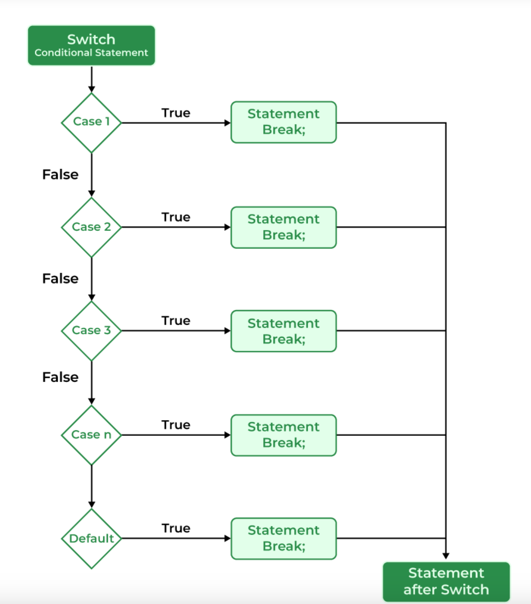

# COMP122 Lecture Notes: December 06, 2023

## Announcements:
   1. Today is the last day of our class

   1. 30-quiz-digital-logic
      - due no later than midnight Thursday night
      - timed instrument : 2 hours
      - open notes

   1. 40-exam-mips
      - due @midnight on Dec 11 (Monday)

   1. All student repos are to be deleted
      - December 22, 2023
      - Copy your repos to build a portfolio 

## Today's Agenda:
   1. Make copies of your Git Repo
   1. Switch Statement TAC
   1. Bash Scripting


## Questions from Last Lecture/Lab, etc.:
   * M/W @ 9:00 am
     - How do your transform a 16-bit value to a 32-bit value?
       * How do a do sign extension?
     - Can you provide an example of Truth Table to Boolean Expression?
 
   * T/R @ 9:00 am
     - How do your transform a 16-bit value to a 32-bit value?
       * How do a do sign extension?
     - Boolean Algebra Properties
     - Boolean Proof
     - Elements of ISA 
     - Pipeline Stages
     - Differences between Combinational Circuits and Sequential Circuits


---
# Today's Lecture Material

   1. Make copies of your Git Repo
      * https://docs.github.com/en/repositories/creating-and-managing-repositories/duplicating-a-repository

      1. (On Github) Create a new blank: 
         - ssh-url: git@github.com:{account}/{repo}.git
      1. Clone the repo onto your machine
      1. 'cd' into the your local working directory
      1. Copy the files you want
      1. Commit to your local repo
      1. Push to your remote repo

      ```bash
      cd ~
      mkdir myrepos
      cd myrepos
      git clone git@github.com:{account}/{repo}.git
      cd {repo}
      cp ~/classes/comp122/deliverables/{assignment}/* .
      cp -r ~/classes/comp122/deliverables/{assignment}/macros .
      git add {filename_1} ... {filename_n}
      git commit -m 'making a copy of my repo'
      git push
      ```

   1. Switch Statement: 
      - Instead of writing many if..else statements, you can use the switch statement.

        ```java if..else example
        value = expression;
        if (x == value) {
           // code block
        else if (y == value ) {
           // code block
        } else { 
          // code block
        }
        ```
      - The switch statement selects one of many code blocks to be executed:
        ```java switch example
        switch(expression) {
          
          case x:
            // code block
            break; 
          
          case y:
            // code block
            break;
          
          default:
            // code block

        }
        ```
      - It is essential syntacic sugar for a nested "if-then-else" statements, 
      - BUT with the ability to "SLIDE" into the next code block!


   1. Switch: Java --> Java TAC translation
      * Requirements
        1. case value is a single variable or immediate (limitation of Java)
        1. must have a break after each case
        1. default must be included and is the last code block

      * Steps:
        1. Identify the parts of the switch statement
           * {start}: the line of code that contains
             `switch( {expression} ) {`
           * {expression}: the scalar expression of the switch
           * {case 1}, .. {case n-1}: the series of consequence code blocks
           * {default}: the alternative code block for the switch
           * {done}: the first line of code executed after the switch

       1. Insert the statement `value = {expression};`  before the switch statement
       1. Assocated the {top} label with `switch( value ) {`
       1. Append the {done} label, with a null statement, after the end of the switch 
       1. For each case
          1. Insert a null statement as the first instruction 
          1. Modify all breaks to be explicit, i.e., `break;` --> `break {top};`
          1. Append `mips.merge();` as the last instruction
       1. For the default
          1. Ensure there is a default!
          1. Insert a null statement as the first instruction (associated with the `case`)
          1. Append `break {top};` as the last instruction

      * Example
        ```java tac
                  value = expression;
        top:      switch(value) {
                    case x:  ;
                             // code block
                             break top;
                             mips.merge();
                    case 2:  ;
                             // code block
                             break top;
                             mips.merge();
                    default: ;
                             // code block
                             break top;
                  }

        done:     ;
        ``` 

   1. Java Switch TAC --> MIPS

      | TAC Equations      | MIPS Instructions                     |
      |--------------------|---------------------------------------|
      | `switch (value)`   | `nop`                                 |
      | `case imm: ;`      | `case_imm: li $gp, imm`               |
      |                    | `          bne value, $gp, {next}`    |
      |                    |                                       |
      | `case a:   ;`      | `case_a:   move $gp, a`               |
      |                    | `          bne value, $gp, {next}`    |
      |                    |                                       |
      | `default:  ;`      | `default:  nop`                       |
      |                    | `          nop`                       |
      | `mips.merge();`    | `b 8`                                 |
      |                    | * an extension to the `b` instruction |

   1. Steps:
      1. Use the Table above to transliterate the Java statements to MIPS
      1. Transform "case a:" as into a label, e.g., 
         *  case 'a': --> case_a:
         *  case  1 : --> case_1:
      1. {next} refers to the next case block
      1. Notice that the `mips.merge()`` highlights so issues!

      * Example
        ```mips
        top:      nop                     # switch(val) {

          case_x: move $gp, x             #   case x:  ;
                  bne  val, $gp, case_2    
                                          #            // code block
                  b 8                     #            mips.merge();

          case_2: li $gp, 2               #   case 2:  ;
                  bne  val, $gp, default   
                                          #            // code block
                  b done                  #            break top;
                  b 8                     #            mips.merge();

         default: nop                     #   default: ;
                  nop                     #
                                          #            // code block
                  b done                  #            break top;
                                          # }

        done:                             # ;
        ```

        * Is this the way the compiler will do it? No!
          

   1. C Switch TAC --> MIPS, with a range
      * Consider the following macro:
        ```mips
        .macro position_in_range(%index, %low, %high)
           # returns index within the range
           # returns -1 if not in the range
           $v0 = -1;
           if (%index >= %low) {
              if (%index <= %high) 
                $v0 = %index - %low;
           }
        .end_macro
        ```
      * Consider the following C switch statement
        ```c
        switch (%input) {
           case '0'...'9' :   digit = digit - '0';
                break;

           case 'A'...'F'  :  digit = digit - 'A' 
                              digit = digit + 10;
                break

           case 'a'...'f'  :  digit = digit - 'a' 
                              digit = digit + 10;
               break;

           default:           digit = -1;
        }
        ```

      * Resulting MIPS code
        ```mips
        case_0_9:   index_in_range(%input, '0', '9')  
                    blt $v0, $zero, case_A_F
                       subi digit, digit, '0'
                       b done

        case_A_F:   index_in_range(%input, 'A', 'F') 
                    blt $v0, $zero, case_a_f
                       subi digit, digit, 'A'
                       addi digit, digit, 10  
                       b done   

        case_a_f:   index_in_range(%input, 'a', 'f') 
                    blt $v0, $zero, default
                      subi digit, digit, 'a'
                      addi digit, digit, 10
                      b done

        default:    li digit, -1
                    b done

        done:       nop    
        ```

        * Consider the semantics of the following switch statement
        ```c
        switch (%input) {
           case '0'...'9' :  
              break;

           case 'A' - 'F'  :  
              break

           case 1, 2, 3, 0 : 
              break;

           case 1 | 2 | 3 | 0 : 
              break;

           case str* :
              break;

           case func(arg) :
              break;

           case > 10 :
              break;

           default:           
              break;
        }
        ```

   1. Bash Scripting / Startup Scripts
      1. $HOME/.bashrc  $HOME/.bash_profile 
      1. Variable Declaration
         - uses the duck rule    # variables a string by default
         - explicit declaration
           * declare -i int_var   
           * declare -a index_array
           * declare -A assoc_array
         - view the type:  declare -p X

      1. Environment Variables:  
         - Definition: X="value"
         - Definition: X=$(command arg)
         - Usage:      ${X}
         - Substring:  ${X:2:2}    # offset:length
         - Length:     ${#X}

      1. Environment Array Variables: 
         - Definition: X[i]="value"
         - Definition: X=( a b c d )
         - Usage:      ${X[i]}
         - Length:     ${#X[i]}    # length of X[i]
         - Size:       ${#X[\*]}   # size of X
         - ???:        ${#X}       == ${#X[0]}

      1. ARITHMETIC EVALUATION
         - ((        ))

      1. CONDITIONAL EXPRESSIONS
         - [[        ]]

      1. Globbing (light-weight regular expressions)
         - *     : any number of characters
         - ?     : one character
         - [a-b] : one character with the set
 
      1. Control Constructs
         - if-then-else
           ```bash
           if test ; then
             list
           elif test ; then 
             list
           else
             list
           fi
           ```
         - while loop
           ```bash
           while test ; do
             list
           done
           ```
         - for loop
           ```bash
           for (( expr1 ; expr2 ; expr3 )) ; do
             list
           done
           ```
         - for each
           ```bash
           for studenet in * ; do
             list
            done
           ```
         - case (aka the switch statement)
           ```bash
           case word in 
              pattern ) 
                  list
                  ;; 
               pattern | pattern )
                  list
                  ;;
               * )
           esac
           ```
      1. Functions:   
         ```bash
         function name () {
           arg1=$1
           arg2=$2
           arg3=$3
           arg_count=$#

           # code
           return 0
         }

         name a b c
         ```

      1. Examples:
         - pull_all
         - git_commit_on_time


# Today's Lab Material

  1. Work on 40-exam-mips


---
## Resources

   * man bash


---
<!-- This section for student's to place their own notes. -->
<!-- This section will not be updated by the Professor.   -->

## Notes  


