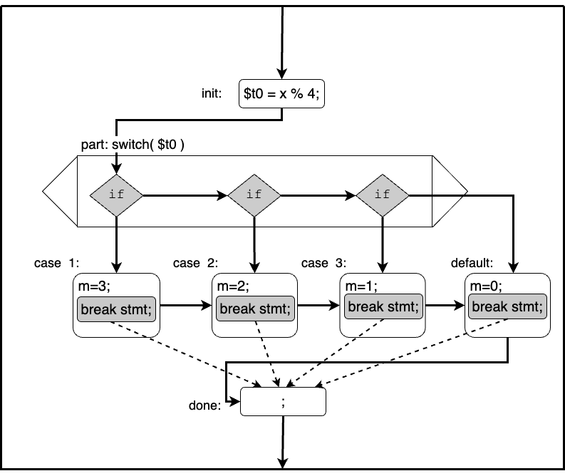

# Process to Writing MIPS code for COMP122

In COMP122, you will be writing Java code to help you develop, debugged, and validated each of your programming assignments. You will then rewrite your Java code to conform to the Professor's Three-Address-Code (TAC) style. Your modified code can validated to ensure your changes does not introduce programming errors. At that point, crafting your MIPS code is mostly a transliteration exercise.

This approach will been developed to achieve the following goals:

  1. Reinforce your understanding of the Java Program Language
  1. Introduce you to operational semantics and compiler technology
  1. Simplify your efforts to craft MIPS code
  1. Focus your attention on the salient material of COMP122

The general programming assignment steps are as follows:

  1. Write a Java Subroutine: `method.j`
     - the Java must conform to a subset of java
     - the algorithm design must match that provided in the specification
     - ensure that it is 100% correct
     
  1. Rewrite Java Subroutine into TAC style: `method.j`
     - ensure that it is 100% correct
     - ensure it it in PROPER TAC form

  1. Transliterate your Java subroutine into MIPS: `method.s`
     - Copy your `method.j` into `method.s`
     - Comment out your Java Code
     - Transliterate: line by line!
       * Each line will match for following format
         ```
         {label}:      {mips instruction}       #  {java instruction}
         ```
     - If you have to do more than transliteration, your Java code is WRONG--even it generates the desired results!

## General Rules for Writing Java Code for COMP122

  1. Strive to keep you code simple and readable
  1. Pick meaningful names for variables
  1. Provide comments that provide clarity of purpose
  1. Keep your mathematical expressions simple
  1. Use the simplest control structure that gets the job done
     * if-then-else
     * for 
     * while
     * do-while
  1. Use structure programming techniques
     * Don't use `goto` statement (which is not allowed in Jave)
     * Don't use the `continue` nor the `break` statement
  1. Don't use Object-Oriented Features: classes, objects, etc., 
     * Remember this is an assembly level class

## Translation of Java --> Java TAC

In this section we provide the process to transform Java code into the Three-Address-Code (TAC) style. This process is performed one statement at a time.  Each of the following sections, provides more detail on this process.

### Conversion of an Assignment Statement and Expressions

The right-hand-side (RHS) of an assignment is a mathematical expression, whereas the left-hand-side (LHS) is a single variable.  To conform to TAC style, you need to simplify the expression to use at most one mathematical operation (or function call).  

Consider the following Java assignment statement:

  ```java
  r =  ( 2 * b + a ) / 3;
  ```
By using PEMDAS (order of operations), you can rewrite the statement as follows:

   ```java
   $t1 = 2 * b;
   $t2 = $t1 + a;
   r   = $t2 / 3;
   ```

Notice that there are three mathematical operations, and each is computed separately with the result placed into a new temporary variable ($t1, $t2, $t3).  We further constrain TAC style to require immediate values (e.g., the literal 2) to be first be assigned to a variable.  With this constraint in place, the resulting set of instructions are:

  ```java tac
  $t0 = 2;
  $t1 = $t0 * b;
  $t2 = $t1 + a;
  $t3 = 3;
  r   = $t2 / $t3;
  ```

By converting the original mathematical expression into TAC style, you can have many different solutions.  As long as you preserve the semantics of expression, you are free to craft the set of instructions via any method you choose.


### [Conversion of an if-then-else statement into TAC](./TAC_transformation/if-then-else2TAC.md)

### [Conversion of a for-loop statement into TAC style](./TAC_transformation/for-loop2TAC.md)

### Conversion of while-loop statement into TAC style

One of the most versatile statements is the `while-loop`. The Java `for-loop`, however, is effectively a `while-loop`, but with improved syntax for readability. As such, we prefer the use of the `for-loop` over the `while-loop`. 

A true `for-loop` iterates for a predefined number of times. This number can be determined prior to ever executing the body of the loop.  Java's `for-each` loop is an example of a true `for` loop.  If you do use a `while-loop`, the first step in the conversion process is to replace the `while-loop` with a `for-loop`.  This replace is performed by simply modify the line that contents the Boole test.

Consider the following `while-loop` construct.

   ```java
   while( <test> ) {
      <body>
   }
   ```

Simple convert your code to match the following template:

  ```java
  for(; <test> ;) {
    <body>
  }
  ```
Then use the process to convert a `for-loop` statement into TAC style.

### Conversion of do-while-loop statement into TAC style

A `do-while` loop differs from a `while` loop in the following ways.
  1. The Boolean test that controls the loop is performed after each iteration.
  1. The `do-whole` loop is guaranteed to execute 1 or more times. 
  1. the `while` loop is guaranteed to execute 0 or more times.
  1. The `do-while` loop is rarely used in high-level programs, and used a lot in low-level programs.

Consider the following `do-while` template.

   ```java
   do {
      <body>
   } while( <test> );
   ```

The resulting TAC style template is a follows:

   ```java
   loop:     do {
   body:       ;            
               <body>

               $l = ...;
               $r = ...;
             } while( $l <comp> $r );
   done:     ;
   ```

Notice the following elements of the resulting template
  1. Three labels have been added: 
     - {loop}, which is associated with the `do {` statement,
     - {body}, which is placed at the beginning of the loop's body
     - {done}, which is the first line of code executed after the for-loop 
  1. Two variables were introduced that represent the LHS and RHS of the Boolean test
     - these two variables are evaluated at the end of the {body} block
  1. The Boolean test has been simplified

[^opt]: Only the {loop} and {done} labels are required.


### Conversion of for-each-loop statement into TAC style

The 'for-each' loop allows one to iterate over a collection, such as an array. Consider the following Java code example which sums the individual elements in the array A.

   ```java
   sum = 0;
   for ( int element in A ) {
      sum += element;
   } 
   ```

This `for-each` statement code can be converted to the following `for` statement 

  ```java
   sum = 0;
   for ( index = 0; index < A.length; index ++ ) {
      sum += A[index];
   } 
   ```
In COMP122, you should reframe from using the `for-each` statement.  


### Conversion of switch statement into TAC style

Instead of writing a set of embedded if-then-else statements, you can use the switch statement. This is highly desirable because it increases the readability and the maintainability of the code.  

Consider the following embedded if-the-else example:

  ```java
  value = expression;
  if (x == value) {
      ; // code block
  } else if (y == value) {
     ; // code block
  } else if (z == value) { 
     ; // code block
  } else {
     ; // code block
  }
  ```

The equivalent code using a switch statement is as follows:

  ```java
  switch(expression) {
          
    case x:
        ; // code block
        break; 
          
    case y:
        ; // code block
        break;

    case z:
        ; // code block
        break;
          
    default:
        ;    // code block
        break;

   }
   ```

Each case block corresponds directly to one of the consequence block of an `if-the-else` statement. The default block corresponds directly to the last alternative block. It is typical that each of case blocks end with a `break`. These `break` statements are not required, but without this statement control flow continues.  Hence, the code for both code blocks are effectveily merged together.  It is raw that this is the desired affect.   As such a case block without a final `break` statement is a common programming bug.

Prior to converting a switch statement into TAC style the following requirements must be met.

  1. each case value must be a single variable or immediate value (limitation of Java)
  1. each case block _should_ end with a `break` statement
  1. a default block must be included and it must be the last code block


Consider the following example of switch statement, and its control flow graph.

   ```java
   switch (x % 4) {
      case 1:
            m = 3;
            break;
      case 2:
            m = 2;
            break;
      case 3:
            m = 1;
            break;
      default:
            m = 0;
            break;

   }
   ```





Notice that the control flow graph depicts a box of code for the entire switch statement, and within this block there are six blocks of code and one control block. The names of these blocks are:

  1. {init}: the block of code that is executed prior to the controlling value of the switch expression
  1. {stmt}: the control block associated with the `switch` key word.
  1. {case 1}: the first case block 
  1. {case 2}: the second case block
  1. {case 3}: the third case block
  1. {default}: the default case block
  1. {done}: the implicit last line of code executed as part of switch statement
     * we insert a `null` statement into the statement to explicitly depict this line of code


Transforming the control-flow graph into equivalent code, using the TAC style, results in the following code.  Notice that in the control-flow graph, we do not include the mips.next() nor mips.merge() statements for brevity.

  ```java tac
  init: {var} = x % 4;
  split: switch ({var}) {
           case 1:
                  mips.next("2")
                  m = 3;
                  break split;
                  mips.merge("2");
           case 2:
                  mips.next("3");
                  m = 2;
                  break split;
                  mips.merge("3");
           case 3:
                  mips.next("default");
                  m = 1;
                  break split;
                  mips.merge("default");
           default:
                  m = 0;
                  break split;
         }
  done:  ; 
  ```


Notice the following
  1. {var}, a control variable for the switch statement, has been introduced
  1. the evaluation of {var} has placed into the {init} section
  1. {split}, a label associated with the switch statment, has been introduced 
  1. for each case block
     - the required `break` statement has the explicit {split} label included
     - begins with "mips.next()"
     - ends with "mips.merge()"
  1. the operand to both "mips.next()" and "mips.merge()" is the value of the next case block or "default"

In the Java program, the mips.next() and mips.merge() methods are effectively comments.  But these methods are important to include to cleary denoted the semantics of the switch statement and to perfrom the transliteration into MIPS.


## Algorithm: switch statement --> TAC Transformation 

Consider the following code template:

  ```java
  switch( <expression> ) {
    case <val_1>:
            <block_1>
    case <val_2>:
            <block_2>
      ...
    case <val_n:
            <block_n>

    default:
            <default_block>
  }
  ```

  1. Insert the {init} label, with a null statement, before the start of the for-loop
  1. Introduce a new variable to serve as the control variable, say $t1
  1. Insert the statement `{var} = {expression};`  into the {init}
     * Transform the statement `{var} = {expression};` into TAC style
  1. Assign a label, {split}, to the  switch statement:  `{split}: switch( {var} ) {`
  1. Append the {done} label, with a null statement, after the end of the switch 
  1. For each case:
     1. Insert a null statement as the first instruction 
     1. Insert `mips.next("{val}");`
        - where {val} is the value assoicate with the next case block
     1. Modify all breaks to be explicit, i.e., `break;` --> `break {split};`
     1. Append `mips.merge("{var}");`
        - where {var} is the value assoicate with the next case block
     * Note that if the next code block is the default block, "{value}" = "default"
  1. For the default:
     1. Ensure there is a default and that it is the last case block
     1. Insert a null statement as the first instruction
     1. Append `break {split};` as the last instruction


### Switch Statements with Ranges

Java does not allow you to include a range within a case statement. This is unfortunate since the use of ranges can yield more readable code. Consider the following C function that converts an ASCII character to an integer.

  ```c
  int toInteger(char input, int radix) {

    switch (input) {
      case '0'...'9' :   digit = digit - '0';
                         break;
      case 'A'...'F' :   digit = digit - 'A' 
                         digit = digit + 10;
                         break;
      case 'a'...'f' :   digit = digit - 'a' 
                         digit = digit + 10;
                         break;
      default:           digit = -1;
    }
    if (digit > (radix - 1)) {
      digit = -1;
    }
    return digit;
  }
  ```

To mimic this function in Java, you need to enumerate each and every case value. For example,

   ```java
   case 'a':
   case 'b':
   case 'c':
   case 'd':
   case 'e':
   case 'f': digit = digit - 'a' 
             digit = digit + 10;
             break;
   ```
You could also write a set of if-then-else statements, but that would result in a mark decrease in the readability of your code.

<!-- We have modify the java_subroutine to allow you to use this extended syntax within your .j code. -->
<!-- to handle the break statement.. just transform them to goto statements, but I don't knwo the real label -->

