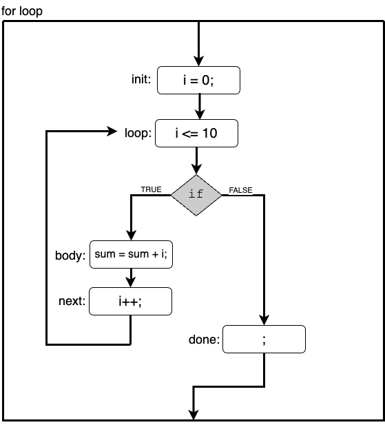

# Conversion of a for-loop into TAC style

The for loop statement is common to every programming language. This statement allows the repetitive execution of a block of code based upon the value of a Boolean expression (known as the `test`). When the value of Boolean expression is TRUE, the block of code is executed. After the block of code is executed, the Boolean expression is then reevaluated.  When the value of Boolean expression is FALSE, the execution of the for-loop is complete and execution flows to the statement after the for-loop.


Consider the following example of an for-loop, and its control flow graph.

   ```java
   for( i=0; i <= 10; i++ ) {
      sum = sum + i;
   }
   ```

The template for this example is as follows:

  ```java
  for( <init> ; <test> ; <next> ) {
    <body>
  }
  ```



Notice that the control flow graph depicts a box of code for the entire for-loop statement, and within this block there are five blocks of code. The names of these blocks are:

  1. {init}: the block of code that is executed prior to the controlling Boolean expression
  1. {loop}: the block of code that contains the Boolean expression.
  1. {test}: the boolean expression of the for-loop statement
  1. {body}: the repetitive code block to be executed each time the for-loop statement executed
  1. {next}: the code block used to setup for the next evaluation of the Boolean expression
  1. {done}: the implicit last line of code executed as part of for-loop statement
     * we insert a `null` statement into the statement to explicitly depict this line of code


Transforming the control flow graph into equivalent code, using the TAC style, results in the following:

  ```java tac
  init:   ;
          i=0;

  loop:   for(; i <= 10 ;) {

  body:     ;
            sum = sum + i;

  next:     ;
            i++;
            continue loop;

          }
  done:   ; 
  ```

Notice that labels have been inserted into the code to explicitly denote the start of each block.  Additionally, the continue statement has been append as the last statement of the `{next}` block.  This statement make explicit as to which instruction to be executed next.

Notice that the semantics of the original Java statement and the resulting statement in TAC form are identical.  While the second form (TAC style) is more tedious to write, it is closer to assembly code -- which is our goal.


## Algorithm: for-loop --> TAC Transformation 

Consider the following code template:

  ```java
  for( <init> ; <test> ; <next> ) {
    <body>
  }
  ```

  1. Identify with labels the section of the loop
     - {init}: the initialization arm of the for-loop
     - {loop}: the line of code that contains
       `for( <init> ; <test> ; <next> ) {`
     - {body}: the body of the for-loop
     - {next}: the next arm of the for-loop
     - {done}: the first line of code executed after the for-loop

  1. Insert the {init} label, with a null statement, before the start of the for-loop
  1. Associate the {loop} label with `for( <init> ; <test> ; <next> ) {`
  1. Append the {done} label, with a null statement, after the end of the for-loop

  1. Insert the {body} label, with a null statement, at the top of the {body}
  1. Insert the {next} label, with a null statement, at the end of the {body}
  1. Append 'continue {loop};' to the end of of the {next} block

     * The resulting template before code movement

       ```java tac
       init:    ;
       loop:    for( <init> ; <test> ; <next> ) {
       body:       ;
                   <body>

       next:       ;

                   continue loop;
                }
       done:    ;
       ```

  1. Move the `<init>` arm to the {init} block

  1. Move the `<next>` arm to the end of the {next} block

  1. Transform the code within the `<test>` arm into TAC style
     * If the `<test>` arm is of the form `a <cond> b`, you are done!
     * Otherwise, simplify the boolean expression into three parts
       - evaluate the left-hand side into $l
         - move the evaluation of $l into the {init} block
         - place a copy of the eval of $l at the end of the {next} block
           * but before the `continue {loop}`
       - evaluate the right-hand side into $r
         - move the evaluation of $r into the {init} block
         - place a copy of the eval of $r at the end of the {next} block
           * but before the `continue {loop}`
       - replace the boolean expression with a simple test: `$l <comp> $r`
         - yielding:  `if ( $l <comp> $r ) {`

Applying the above algorithm results in the following template:

  ```java tac
  init:    ;
           <init>
           $l = ...;
           $r = ...;
  loop     for(; $l <comp> $r ;) {
  body:      ;
             <body>
  next:      ;
             <next>
             $l = ...;
             $r = ...;
             continue loop;
           }
  done:    ;
  ```

[^opt]: Only the {loop} and {done} labels are required.
