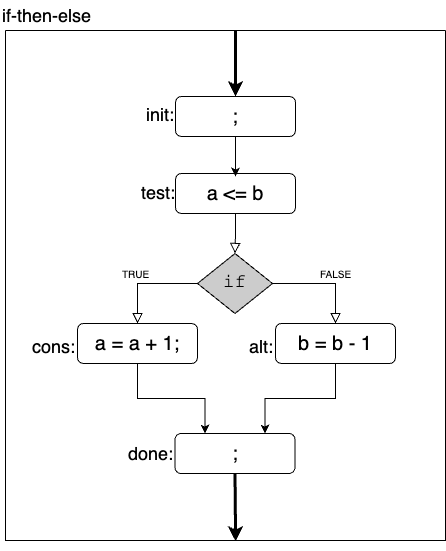

# Conversion of an if-then-else statement into TAC Style

The if-the-else statement is common to every programming language.  This statement conditional executes one of two blocks of code based upon the value a Boolean expression (known as the `test`).  These two blocks of code are known as the consequence (cons) and the alternative (alt).  The `cons` block is executed whenever the Boolean expression is evaluated as TRUE, alternatively the `alt` block is executed. 


Consider the following example of an if-then-else statement, and its control flow graph.

  ```java
  if ( a <= b ) {
    a = a + 1;
  } else {
    b = b - a;
  }
  ```



Notice that the control flow graph depicts a box of code for the entire if-then-else statement, and within this block there is five blocks of code that are directly associated with if-then-else statement.  The names of these blocks are:

  1. {init}: the implicit first line of code executed as part of the if-then-else statement
  1. {test}: the boolean expression of the if-then-else statement
  1. {cons}: the consequence code block for the if-then-else statement
  1. {alt}:  the alternative code block for the if-then-else statement
     * for an if-then statement, this block of code implicitly exists as a `null` block
  1. {done}: the implicit last line of code executed as part of if-then-else statement
     * we insert a `null` statement into the statement to explicitly depict this line of code

Transforming the control flow graph into equivalent code, using the TAC style, results in the following:

  ```java tac
  init:   ;
  test:   if ( a <= b ) {
  cons:      ;
             a = a + 1;
             // goto next;
           } else {
  alt:     ;
             b = b - a;
             // goto next;
           }
  done:  ; 
  ```

Notice that labels have been inserted into the code to explicitly denote the start of each block.  Additionally, a comment has been inserted at the end of both the `cons` and `alt` blocks to explicitly indicate the intended control flow. Most programming languages provide a `goto` statement, but Java has reserved the `goto` keyword -- as such we need to include this statement within a comment.  (In other programming languages, e.g., C, there is n need to comment out this statement.)

Notice that the semantics of the original Java statement and the resulting statement in TAC form are identical.  While the second form (TAC style) is more tedious to write, it is closer to assembly code -- which is our goal.


## Algorithm:  If-then-else --> TAC Transformation 

Consider the following code template:

   ```java
   if ( <test_block> ) {
     <consequence block>
   } else {   
     <alternative block>
   }
   ```

   1. Insert the {init} label, with a null statement, before the start of the if-then-else

   1. Append the {done} label, with a null statement, after the end of the if-then-else

   1. Identify the other three parts of the if-the-else statement statement
      * {test}: the boolean expression of the if-then-else statement
      * {cons}: the consequence code block for the if-then-else statement
      * {alt}:  the alternative code block for the if-then-else statement

   1. Transform the code within the `<test_block>` arm into TAC style
      * If the test code is of the form `a <comp> b`, you are done!
      * Otherwise, simplify the boolean expression into three parts
        - evaluate the left-hand side into $l
          - move the evalution of $l into the {init} block
        - evaluate the right-hand side into $r
          - move the evaluation of $r into the {init} block
        - replace the boolean expression with a simple test:  `$l <comp> $r`
          - yielding:    `if ( $l <comp> $r ) {`

   1. Transform the `cons` block into TAC style
      1. Insert the {cons} label, with a null statement, at top of the consequence code block
      1. Append '// goto {done};' to the end of consequence code block
      1. Transform the code within the block to conform to the TAC style

   1. Transform the `cons` block into TAC style
      1. Insert the {alt} label, with a null statement, at top of the alternative code block
      1. Append '// goto {done};' to the end of consequence code block
      1. Transform the code within the block to conform to the TAC style

Applying the above algorithm results in the following template:

   ```java tac
   init:    ;
            $l = ...;
            $r = ...;
            if( $l <comp> $r ) {
   cons:      ;
              <consequence>
              // goto done;
             } else {  
   alt:       ;
              <alternative>
              // goto done;
            }
   done:    ;
   ```

