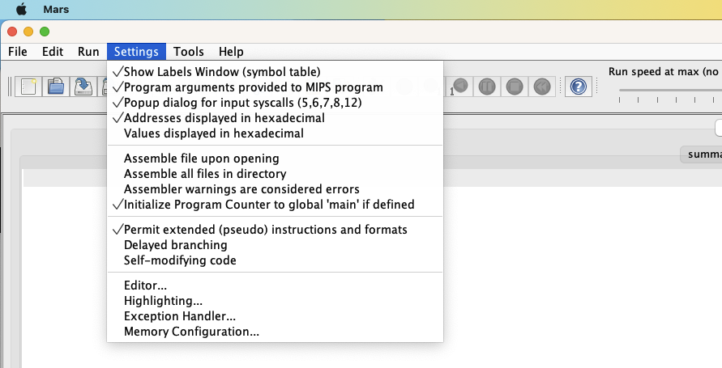

# MARS: 

During this semester, you will be learning about the MIPS assemble language. We will be using the MARS IDE. This file walks you through a services of exercises to become familiar with the MARS IDE.


1. Review the files in the `~/classes/comp122/reference/mars`
   ```
   $ ls ~/classes/comp122/reference/mars
   mars_features.docx  mars_tutorial.doc
   ```

1. Open the MARS simulator
  * Change to your working directory <br>
    For the exercises in this document, the w
    ```
    cd ~/classes/comp122/mips
    ```
  * Launch Mars
    ```
    mars &
    ```
    - the "&" at the end of the commands, runs mars in the background
    - running the command in the background will allow you to retain terminal control

1. Complete the following exercises

  1. Exercise #0: Review the Menu Bar.
     1. The menu bar is broken down into three major sections: 
     1. File operations: New, open, save
     1. Edit operation: Undo, redo, cut, paste, etc.
     1. Run operations: Assemble, execute, forward step, backward step, pause, stop, reset.
     1. Settings:

  1. Exercise #0: Validate you have the correct default settings
     1. Click on the "Settings" tab in the tool bar:
     1. Review the options and make them match the settings in the following graphic

     

 
  1. Exercise #2: Load and execute the "empty" code
     1. Load the 'empty.s' code: (File -> Open )
     1. Assemble the code: (Run -> Assemble)
     1. Step through your code: (Run -> Step)
     1. Watch what happens in the Text Segment window
 
  1. Exercise #3: Load and execute the "hello_world" code
     1. Load the 'hello_world.s' code: (File -> Open )
     1. Assemble the code: (Run -> Assemble)
     1. Single step through the program until the simulator stops
     1. Watch what happens in the Text Segment and the Register windows
     1. Notice what happens when you encounter the 'syscall' command.
        * This is a trap to the kernel
        * An internal subcommand is executed that prints a string. 
        * The syscall takes two arguments; in our example, the values are stored in two special registers: $v0 and $a0. 
        * The value of the $v0 register specifies that system should print a string. 
        * The value of the $a0 register contains the address in memory of the string to be printed.
        * When you step over this 'syscall' command, look at the console window where the string "hello world" should be printed. All I/O results are performed within this window.

  1. Exercise #4: Load and execute the "echo_int" code
     1. Load the 'echo_int.s' code: (File -> Open )
     1. Assemble the code: (Run -> Assemble)
     1. Single step through the program until the simulator stops
     1. Watch what happens in the Text Segment and the Register windows
        * In this example, the simulator should stop on the 'syscall' command. 
        * This particular call to the 'syscall' command reads and integer from the console. 
        * You should enter a integer (followed by a return) in the console. 
        * Notice the value of the entered number has been placed into register $v0. 
        * This number is then placed into memory, by the 'sw' instruction, at the address 'num'. 
        * This number is then read from memory, by the 'lw' instruction, from the address 'num'
        * We also move this value into $v0.  This register is subsequently used by the next 'syscall' command to print the integer out to the console.

   1. Exercise #5: Load and execute the "add4.s"
        1. Load the 'add4.s' code: (File -> Open )
        1. Review the Java code provided in comments and examine the associated MIPS code
        1. Assemble the code: (Run -> Assemble)
        1. Set a break point on line 23 
           * Check the "Bkpt" box  in the first column associated with line 23
        1. Hit the Play button to execute your program until the first breakpoint
        1. Now Single step through the program unit you are about to executed line 26
        1. Examine the value of the $v0 register, it should contain the value 10 (0x0000000a)
           * This is the return value of your the "add4 subroutine"

   1. Exercise #6: Load and execute the "summation.s" code
        1. Load the 'summation.s' code: (File -> Open )
        1. Assemble the code: (Run -> Assemble)
        1. Review the Java code provided in comments and examine the associated MIPS code
        1. Run the program to completion
        1. Note the value in the $v0 register and the value printed to the "Run I/O" window
        1. Rewind your program
        1. Single step your program.
        1. Update the value of the $a0 register
           * Notice the value of the $a0 register is 4:  (1+2+3+4=10)
           * Modify the value of the $a0 register to be 5:  (1+2+3+4+5=15)
        1. Hit the Play button to execute the reset of the program
        1. Validate the return value is now 15.