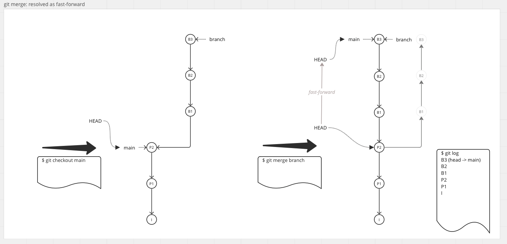

# COMP122 Tid-Bit: Git Merging

## Simple Merging:
   - The process of integrating two branches together.
   - The process is simple if both branches share a history.
     * For example,  origin/main into main

   - Use cases: Using an upstream repository 
     * to publish from a single local repository (Prof -> comp122-s23)
     * as a read-only source (Students <- comp122-s23)

### Git Pull with comp122-s23
   - Command: `git pull`
   - Equivalent Commands:
     - `git pull origin`
     - `git pull https://github.com/COMP122/comp122-s23.git`
   - Internal commands:
     - `git fetch origin`
     - `git merge origin/main`
   - Types of Merging:
     - No Op: "Already up to date." 
       
     - Fast Forward
       


## Git Merge: The General Case
   - The process of integrating two branches together.
   - The process is simple if both branches share a history.
   - Without a shared history, a merge conflict could occur?
   - Merge conflicts require human intervention!

### Overwrite Warnings:
  1. File IS NOT tracked: 
     - File of the same name is in origin/main and working directory.
     - The file is NOT in the local repository.
     - The file in the working directory would be overwritten.
     - Example: You created the file notes_02_06.md before the Prof did!

       ```
       $ git pull -q
       error: The following untracked working tree files would be overwritten by merge: notes_02_06.md
       Please move or remove them before you merge.
       Aborting
       $
       ```

  1. File IS tracked:
     - File of the same name is in origin/main and the index
     - The file has not be committed
     - Example: You modified but did not commit updates to notes_02_06.md
 
       ```
       $ git add notes_02_06.md
       $ git pull -q
       error: Your local changes to the following files would be overwritten by merge: notes_02_06.md
       $ 
       ```


### The Merge Conflict Example
  ```
  $                 # git checkout main
  $ git pull        # git merge origin main
  Auto-merging notes_02_06.md
  CONFLICT (content): Merge conflict in notes_02_06.md
  Automatic merge failed; fix conflicts and then commit the result.
  $ git status
  On branch main
  Your branch is ahead of 'origin/main' by 5 commits.
  (use "git push" to publish your local commits)

  You have unmerged paths.
  (fix conflicts and run "git commit")
  (use "git merge --abort" to abort the merge)

  Unmerged paths:
  (use "git add <file>..." to mark resolution)

  both modified:   notes_02_06.md

  no changes added to commit (use "git add" and/or "git commit -a")
  ```

  ```
   $ cat notes_02_06.md
     # Example of a merge conflict

   This line is the same in both files

   <<<<<<< HEAD
   This line is in both branches but differ: local
   =======
   This line is in both branches but differ: origin/main
   >>>>>>> e2f1d7365e2e6f3726246906f4ba299afeac9515

   This line is the same in both files
   ```

   ```
   $ git add notes_02_06.md
   $ git commit -m 'fixed  conflict'
   ```


### Branches and Merging
   - Create a branch to start independent development
     * `git branch branch`

   - Checkout the branch to work independently
     * `git checkout branch`

   - Perform a merge to incorporate other work
     - To merge independent work back into main
       ```
       git checkout main
       git merge branch
       ```
       

     - To merge main into independent work to get important updates
       ```
       git checkout branch
       git merge main
       ```
       


   - Types of Merging

     | Types of Merging  | Description |
     |-------------------|-------------|
     | Fast Forward      | HEAD->commit moves to HEAD->branch              |
     | True Merge        | commits are interleaved in chronological order  |
     | Rebase            | "branch" is shifted upto the Head->main         |
  
     
     
     \# [Graph of Rebase Merge](documents/git-rebase-branch.png)  # Left for the future

---
## Related Git Commands:
| Command                 | Description                                    |
|:------------------------|:-----------------------------------------------|
| git pull                | -> git fetch ; git merge \<origin\> \<main\>   |
| git fetch               | Downloads remote repo to local repo            |
| git merge \<name\>      | Merges \<name\> with current branch            |              

| Command                 | Description                                    |
|:------------------------|:-----------------------------------------------|
| git commit              | Complete the merge (after you fix the conflict)
| git merge --continue    | Complete the merge (after you fix the conflict |
| git merge --abort       | Revert back to the commit before git merge     |


| Command                 | Description                     |
|:------------------------|:--------------------------------|
| git branch              | List all branches               |
| git branch \<name\>     | Creates branch named \<name\>   |
| git branch -d \<name\>  | Deletes branch named \<name\>   |


---
## Options to Managing Your Class Notes
  1. Maintain notes outside of ~/classes/comp122
     - Pro: simple and easy
     - Con: your notes and Prof's notes are in two different places 
  1. Maintain notes inside of ~/class/comp122, e.g., my_notes_02_06.md
     - Pro: simple with your notes colocated with Prof's notes
     - Con: not using the power of git
  1. Maintain notes in the local comp122 repository
     - Pro: using git with local backup
     - Con: main branch will always ahead of origin/main
  1. Maintain notes in notes_02_06.md in your own branch
     - Pro: improving your git skills
     - Con: need to maintain a branch, possible merge conflicts


## Branching Procedure for Maintaining your Notes
  1. Initial Setup: 
     - create a local branch: `git branch my_notes`
  1. Pre-class Routine:
     - `git checkout main`
     - `git pull`
     - `git checkout my_notes`
     - `git merge -m 'merging updates from Prof' main`
  1. Update Your Notes Routine:
     - `git checkout my_notes`
     - `subl notes_02_06.md`
       * edit just the "Notes" section to avoid merge conflicts
     - `git commit -m 'my notes from today' notes_02_06.md`

  * Condensed form on the "my_notes" branch
    - `git fetch`
    - `git merge -m 'prof updates' origin main`
    - `subl notes_MM_DD.md`
    - `git commit -m 'my notes' notes_MM_DD.md`
     
    

---
## Notes
<!-- This section is for students to place their notes -->


